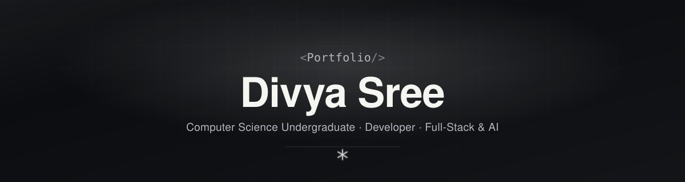

<div align="center">



<br />

[](https://nextjs.org)
[](https://www.typescriptlang.org)
[](https://tailwindcss.com)
[](https://www.framer.com/motion)
[](#license)

*A premium, editorial-minimal developer portfolio — monochrome, motion-driven, and built to feel like one cohesive product rather than a stack of sections.*

</div>

<br />

## `<Overview />`

This is a personal portfolio built with **Next.js 15 (App Router)**, **TypeScript**, **Tailwind CSS**, and **Framer Motion** — no UI kit, no template. Every color, spacing value, and animation curve is a design token defined once and reused everywhere, styled after the restraint of products like Linear, Vercel, and Stripe rather than a typical "dev portfolio" aesthetic.

**Live sections:** Home · About · Education · Skills · Projects · Achievements · Certifications · Gallery · Contact

## `<Highlights />`

- **Draggable + scrollable project carousel** — native `overflow-x` scroll (trackpad, touch, and click-drag all work), with subtle edge arrows that fade in/out based on scroll position, and a wheel listener that stops diagonal trackpad gestures from bleeding into vertical page scroll.
- **Infinite gallery marquee** — a pure CSS keyframe loop, no JS scroll-jacking, that gracefully slows (rather than stops) under `prefers-reduced-motion`.
- **Scroll-spy navigation** — `IntersectionObserver`-driven active section tracking with a `layoutId`-animated underline, not scroll-offset math.
- **Ambient background system** — layered radial glows, a faint grid, and film-grain noise, all built from the same monochrome palette — no color, no gradients outside the grayscale.
- **Fully data-driven content** — every section reads from two files (`lib/site-config.ts`, `lib/data.ts`); no copy is hardcoded inside components.

## `<Tech Stack />`

| Layer | Choice |
|---|---|
| Framework | Next.js 15 (App Router) |
| Language | TypeScript (strict mode) |
| Styling | Tailwind CSS + custom design tokens |
| Motion | Framer Motion |
| Icons | lucide-react |
| Fonts | Space Grotesk, Inter, JetBrains Mono, Unbounded (via `next/font/google`) |

## `<Getting Started />`

```bash
npm install
npm run dev
```

Then open **http://localhost:3000**.

```bash
npm run build     # production build
npm run typecheck # TypeScript check with no emit
npm run lint      # ESLint
```

## `<Project Structure />`

```
app/                   Root layout, home page, globals.css, SEO routes
components/
  ui/                  Design-system primitives (Button, Card)
  sections/            One file per page section (Hero, About, Projects, ...)
  navbar.tsx           Sticky nav with scroll-spy active indicator
  footer.tsx
  background-fx.tsx    Grid + noise + spotlight ambient background
  section-heading.tsx  Shared <Tag /> eyebrow + title heading
hooks/
  use-active-section.ts  IntersectionObserver-based scroll-spy
lib/
  site-config.ts       Name, role, contact details, nav links, socials
  data.ts              Education, skills, projects, achievements, certs, gallery
  utils.ts             `cn()` classname helper
public/
  images/              Portrait, gallery reel, project screenshots, badges
  resume.pdf
scripts/               One-off scripts used to generate placeholder assets
```

## `<Editing Content />`

Everything content-related lives in **`lib/site-config.ts`** (identity, contact info, social links, nav) and **`lib/data.ts`** (education, skills, projects, achievements, certifications, gallery) — edit those two files rather than hunting through components.

Gallery images are generated from a list in `lib/data.ts`, not hardcoded per file — add or remove images by editing that list and dropping files in `public/images/gallery/` named `01.jpg`, `02.jpg`, etc.

## `<Design System />`

All tokens live in `tailwind.config.ts` under `theme.extend` — one source of truth for color, type scale, spacing, radii, and easing.

| Token | Hex |
|---|---|
| Background | `#0B0D10` |
| Alt section | `#101317` |
| Card | `#171B20` |
| Border | `#2A2F36` |
| Text primary | `#F5F5F2` |
| Text secondary | `#B4B8BF` |
| Text muted | `#80858F` |
| Hover surface | `#1D2229` |

**Type:** Space Grotesk (section headings), Unbounded (hero name only), Inter (body), JetBrains Mono (tags, numerals).

## `<License />`

MIT — personal project, free to reference or fork.

<div align="center">
<sub>Built with care, one design token at a time.</sub>
</div>
